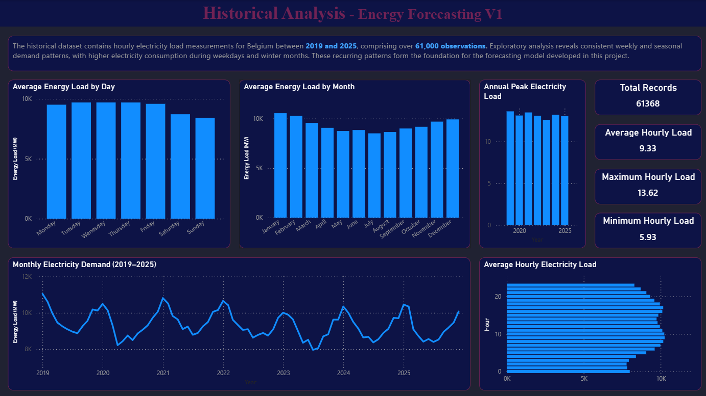
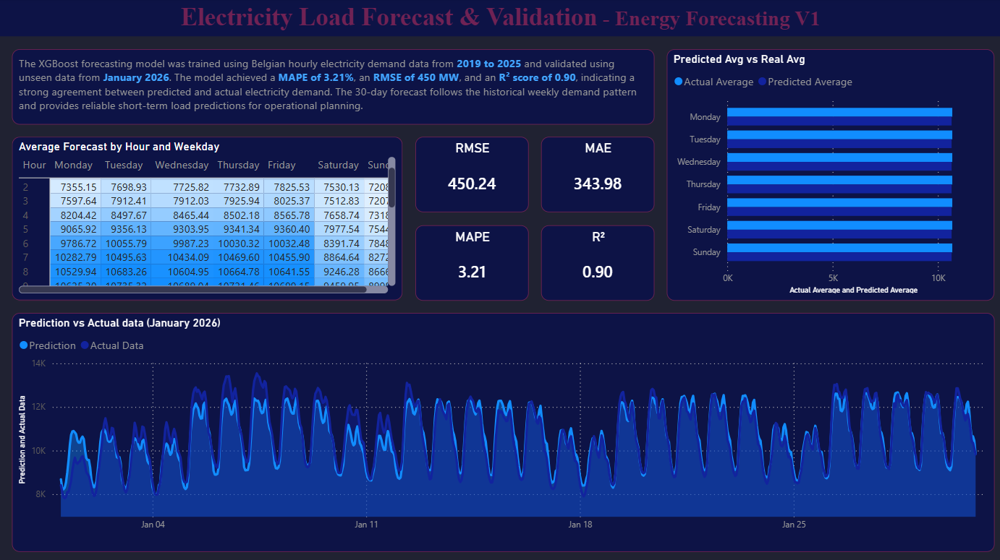
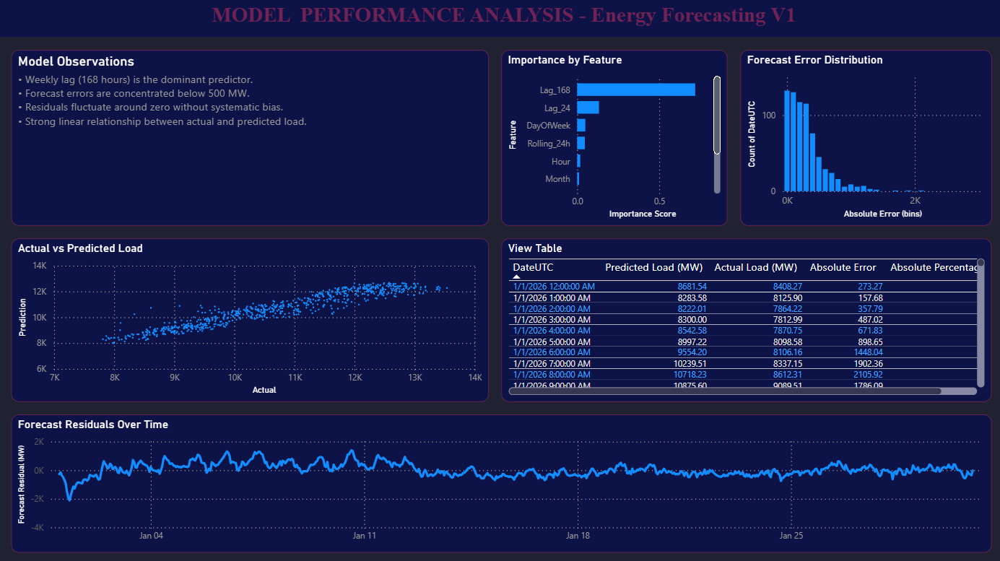

# Belgium Electricity Demand Forecasting

An end-to-end data analytics project that forecasts hourly electricity demand in Belgium using machine learning.

The project covers the complete data lifecycle, including data collection, ETL, exploratory analysis, feature engineering, forecasting, model evaluation, and business intelligence reporting with Power BI.

---

## Project Objectives

- Build an end-to-end ETL pipeline
- Perform exploratory data analysis
- Engineer time-series features
- Train a machine learning forecasting model
- Evaluate forecasting accuracy
- Create an interactive Power BI dashboard

## Project Workflow

## Scripts Description

| Script                        | Description                                                      |
| ----------------------------- | ---------------------------------------------------------------- |
| `01_combine_load_files.py`    | Combines yearly datasets.                                        |
| `02_clean_data.py`            | Cleans and prepares the data.                                    |
| `03_eda.py`                   | Performs exploratory data analysis.                              |
| `04_feature_engineering.py`   | Creates lag features, rolling averages and time-based variables. |
| `05_forecast_model.py`        | Trains the XGBoost forecasting model.                            |
| `06_evaluation.py`            | Evaluates the forecasting model using MAE, RMSE, MAPE and R².    |
| `08_real_world_validation.py` | Validates the model on unseen real-world data.                   |

# Power BI Dashboard

## Historical Analysis

---

## Forecast Dashboard

---

## Model Evaluation

## Data

The raw datasets used in this project are not included in this repository.

The original files are relatively large and publicly available from the ENTSO-E Transparency Platform. To keep the repository lightweight, only the source code and documentation are included.

To reproduce this project:

1. Download the datasets from ENTSO-E.
2. Place them in `data/raw/`.
3. Run the ETL pipeline.
4. Train the forecasting model.
5. Open the Power BI dashboard.

## Future Improvements

- Weather integration
- Holiday features
- Longer forecasting horizon
- Automated ETL pipeline
- API deployment
- Cloud deployment
